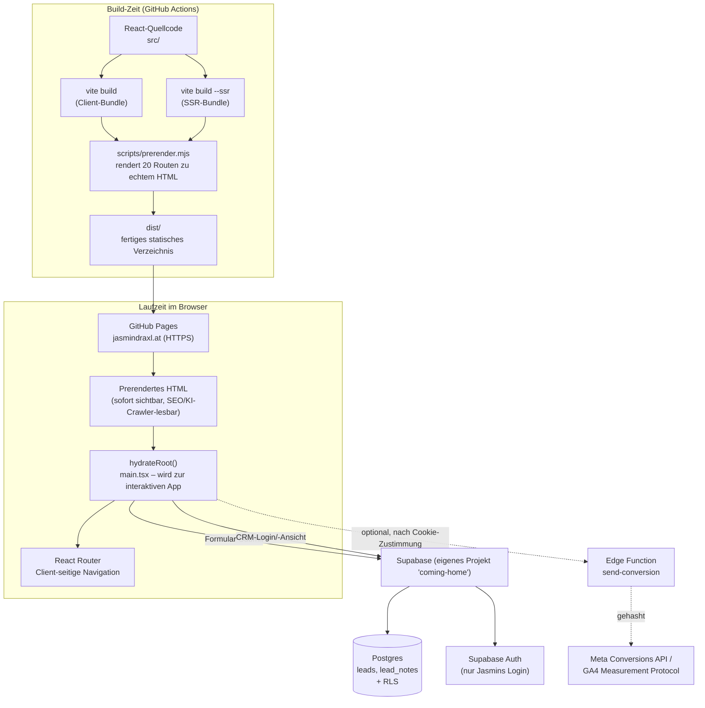
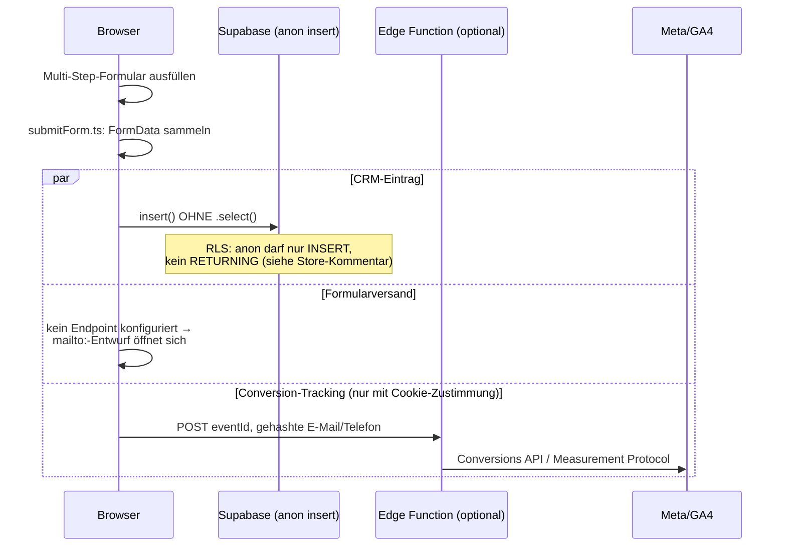
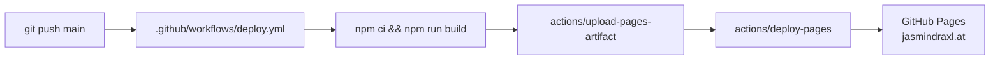

# Coming Home – Architektur

**Stand:** 30. August 2026. Beschreibt den tatsächlichen Ist-Zustand des
Repositories, keine Zielarchitektur.

## 1. Überblick

Coming Home ist eine **statisch vorgerenderte React-Website** mit einem
**schlanken, Supabase-basierten Backend** ausschließlich für das interne
Lead-CRM. Es gibt keinen eigenen Anwendungsserver – die gesamte "Backend"-
Funktionalität läuft entweder direkt im Browser gegen Supabase oder in einer
einzelnen optionalen Supabase Edge Function.



## 2. Frontend

| Aspekt | Technologie | Begründung |
|---|---|---|
| Framework | React 19 + React Router 7 | Bewusst kein Next.js/Remix – bei einer reinen SSG-Site ohne Server-Runtime bräuchte man deren Server-Feature nicht, aber deren Konventionen. Ein schlankes Vite-Setup ist hier einfacher zu verstehen und zu warten. |
| Build-Tool | Vite 7 | Schnelle Dev-Loop, sauberer Umgang mit `base`-Pfad (relevant für den früheren GitHub-Pages-Unterpfad, jetzt Custom Domain). |
| Styling | CSS Modules (keine Utility-Library) | Kein Tailwind/Styled-Components – Scoped CSS pro Komponente reicht für die Seitengröße, keine zusätzliche Build-Abhängigkeit, volle Kontrolle über das feine, markentypische Design. |
| Rendering | Statisches Prerendering + Hydration | Siehe Abschnitt 4. |
| State | `useState`/`useSyncExternalStore`, kein globaler State-Manager | Kein Redux/Zustand nötig – der einzige "globale" State ist das CRM (siehe `crm/store.ts`, per `useSyncExternalStore` sauber an React angebunden) und lokale UI-States (Formulare, Player). |
| Schriftarten | `@fontsource-variable` (lokal gebündelt) | Bewusst kein Google-Fonts-Request – DSGVO-relevant, keine Drittanbieter-Verbindung beim Laden von Schriftarten. |

### Ordnerstruktur (`src/`)

```
components/   Wiederverwendbare UI-Bausteine (Button, Field, Formulare, …)
sections/     Homepage-spezifische, komponierte Abschnitte (Hero, Faq, …)
pages/        Routen-Ebene, nach Domäne gruppiert (legal/, ratgeber/, services/, crm/, editor/)
data/         Statische Inhalte als typisierte TS-Module (site.ts, services.ts, articles.ts, …)
crm/          CRM-Domänenlogik: auth.ts, store.ts, supabaseClient.ts, supabaseStore.ts, types.ts
cms/          Lokaler Text-Editor (Entwurfs-Speicher, Feld-Flattening) – siehe Abschnitt 6
lib/          Utilities: url.ts (Base-Path), submitForm.ts, tracking.ts
hooks/        Kleine, fokussierte Custom Hooks
seo/          Pro-Route-Metadaten für den Prerender
styles/       Ein einziges global.css (Resets, CSS-Variablen)
```

**Bewertung:** Diese Struktur ist für die aktuelle und absehbare Größe des
Projekts (eine Marketing-Site, kein wachsendes Produkt mit vielen Teams)
angemessen und skaliert gut genug. Eine tiefere Schichtung (z. B.
`features/`-Ordner mit je eigenen `components/hooks/api`) wäre für diesen
Umfang **Overengineering** – die Trennung nach `data` (Inhalt) vs. Komponenten
(Darstellung) vs. `crm`/`lib` (Logik) ist bereits die relevante Trennung.
**Keine Restrukturierung empfohlen.**

## 3. Rendering-Modell: SSG + Hydration

1. `vite build` erzeugt das normale Client-Bundle (`dist/assets/*.js`).
2. `vite build --ssr src/entry-server.tsx` erzeugt zusätzlich ein
   Node-lauffähiges SSR-Bundle (`dist-ssr/entry-server.js`), das dieselbe
   `<App/>` mit `renderToString()` statt `hydrateRoot()` rendert.
3. `scripts/prerender.mjs` importiert dieses SSR-Bundle, rendert **jede**
   Route aus `src/seo/pages.ts` (aktuell 20 Seiten: Startseite, 4
   Service-Detailseiten, 10 Ratgeber-Artikel, 3 Rechtstexte, Index-Seiten)
   einmal serverseitig durch und schreibt das Ergebnis als eigenständige
   `dist/<route>/index.html` – inklusive vollständigem `<head>`
   (Title, Description, Canonical, Open Graph, JSON-LD) pro Seite.
4. Im Browser lädt `main.tsx` das normale Client-Bundle. Weil im
   Root-`<div>` bereits Markup steht, nutzt React `hydrateRoot()` statt
   `createRoot()` – die Seite wird interaktiv, ohne neu zu rendern.

**Warum dieser Aufwand statt einfachem CSR:** Reine Client-Side-Rendering-SPAs
liefern Crawlern (inkl. KI-Crawlern wie GPTBot/ClaudeBot/PerplexityBot) nur ein
leeres `<div id="root">`. Für eine Website, deren Geschäftszweck direkt von
Auffindbarkeit abhängt, war das nicht akzeptabel – daher der Prerender-Schritt
trotz der zusätzlichen Build-Komplexität.

**Wichtige Nebenbedingung:** Jeder Code, der `window`/`document`/`localStorage`
anfasst, **muss** in `useEffect` laufen (nicht im Render-Body) – sonst crasht
`renderToString()` beim Build oder es entstehen Hydration-Mismatches. Diese
Regel wird im gesamten Code konsequent eingehalten (u. a. Grund für einige der
`useEffect`-Guards in `MusicPlayer.tsx`, `Hero.tsx`, `useScrollProgress.ts`).

## 4. Backend: Supabase (Projekt „coming-home")

Ein einzelnes, für dieses Venture dediziertes Supabase-Projekt (Region
Frankfurt/EU, `kvfjmptddweoaawesqyc`), **komplett getrennt** von allen anderen
Projekten/Ventures, die derselbe Betreiber sonst noch führt – jedes Venture
hat sein eigenes Supabase-Projekt, keine geteilten Tabellen.

### Datenbank

Zwei Tabellen, siehe `supabase/migrations/00000000000001_leads.sql`:

- **`leads`** – ein Datensatz pro Formular-Anfrage (Bewerbungsbogen, Kontakt,
  Newsletter), inkl. `status` (Pipeline-Stadium) und `fields` (JSONB,
  formularspezifische Rohdaten).
- **`lead_notes`** – interne Notizen zu einem Lead, 1:n zu `leads`.

### Zugriffsmodell (RLS)

| Rolle | `leads` | `lead_notes` |
|---|---|---|
| `anon` (Website-Besucher:in) | nur `INSERT` | kein Zugriff |
| `authenticated` (Jasmins Login) | voller Zugriff | voller Zugriff |

Der öffentliche `anon`-Key liegt zwangsläufig im Client-Bundle – deshalb darf
er laut RLS-Policy **nie mehr** als "einen Lead anlegen" dürfen. Das ist die
zentrale Sicherheitsentscheidung dieses Backends und wird durch Row Level
Security auf Datenbankebene erzwungen, nicht nur im Frontend geprüft.

### Auth

Reines E-Mail/Passwort-Login über Supabase Auth (`src/crm/auth.ts`), ein
einziger vorgesehener Account (Jasmin). Keine Selbstregistrierung über die
Website-UI. **Offene Prüfung** (siehe `AUDIT.md`, Punkt C2): ob
Supabase-seitig "Allow new users to sign up" deaktiviert ist, muss der
Betreiber im Dashboard verifizieren – das ist außerhalb dessen, was aus dem
Code ersichtlich ist.

### Dual-Mode-Fallback (wichtige Architekturentscheidung)

`src/crm/store.ts` exportiert `crmStore`, das je nach Konfiguration entweder
`supabaseCrmStore` (wenn `VITE_SUPABASE_URL`/`_ANON_KEY` gesetzt sind) oder
`localStorageCrmStore` (Fallback) ist – **derselbe Interface-Vertrag**
(`CrmStore` in `crm/types.ts`), unabhängig vom Backend. Das erlaubt lokale
Entwicklung/Vorschau ganz ohne Supabase-Zugangsdaten, ohne den Produktionscode
zu verzweigen.

### Edge Function (optional, aktuell nicht deployt)

`supabase/functions/send-conversion/` – leitet Lead-Events serverseitig an die
Meta Conversions API und das GA4 Measurement Protocol weiter (zuverlässiger
als reines Browser-Pixel bei Adblockern). E-Mail/Telefon werden dabei
ausschließlich SHA-256-gehasht übertragen. Wird nur aktiv, wenn
`VITE_CONVERSION_ENDPOINT` gesetzt ist – aktuell nicht der Fall.

## 5. Formular- und Tracking-Datenfluss



**Wichtiger, bereits gelöster Stolperstein:** `supabase-js`s `.insert().select()`
verlangt implizit eine SELECT-fähige RLS-Policy (wegen `RETURNING`), die
`anon` bewusst nicht hat. Der Code ruft deshalb **nie** `.select()` nach
einem anonymen Insert auf (`src/crm/supabaseStore.ts`, Kommentar dort erklärt
das explizit) – ein leicht zu übersehender Fallstrick, der sonst jeden
Formular-Submit fälschlich fehlschlagen ließe.

## 6. Weitere interne Werkzeuge

- **`/intern/crm`** – Lead-Übersicht, siehe oben. Nicht in Sitemap/Nav
  verlinkt, per `robots.txt` von Indexierung ausgeschlossen.
- **`/intern/editor`** – Ein rein lokaler (localStorage) "WordPress-artiger"
  Text-Editor (`src/cms/`) zum Durchsuchen/Bearbeiten der Inhalte aus
  `data/site.ts`. Änderungen werden **nicht** live für andere
  Besucher:innen – nur als Entwurf im eigenen Browser, mit Export-Funktion
  für die manuelle Übernahme in den Code. Bewusst kein echtes Backend dafür
  gebaut (siehe README) – für den aktuellen Umfang (eine Person pflegt
  Inhalte, hat aber Code-Zugriff über diese KI) unverhältnismäßiger Aufwand.

## 7. Deployment



- **Kein Staging-Environment.** Jeder Push auf `main` geht direkt in
  Produktion. Für eine Ein-Personen-Website mit KI-gestützter Entwicklung
  aktuell pragmatisch, aber siehe `AUDIT.md` H2 für die Empfehlung eines
  CI-Gates.
- **Custom Domain:** `jasmindraxl.at`, per `public/CNAME` (landet bei jedem
  Build automatisch in `dist/CNAME`) + GitHub-Pages-API-Konfiguration.
  HTTPS-Zertifikat aktiv, „Enforce HTTPS" erzwungen.
- **Environment-Trennung:** Lokale Entwicklung nutzt `.env` (gitignored),
  Produktion nutzt GitHub-Repo-Secrets, injiziert als Build-Zeit-Env-Vars im
  Workflow. Beide zusammen ergeben denselben `VITE_*`-Vertrag – kein
  Drift-Risiko zwischen den Umgebungen, weil es dieselbe `vite.config.ts`
  ist, die beide liest.

## 8. Security-Modell (Zusammenfassung, Details in `SECURITY.md`)

Das zentrale Prinzip: **Der öffentliche `anon`-Key darf technisch nichts
Kritisches können.** Jede Rechteausweitung passiert ausschließlich über einen
echten Login (Supabase Auth) plus serverseitig erzwungene RLS-Policies – nie
über eine Frontend-Prüfung allein. Cookie-/Tracking-Einwilligung wird
client-seitig gespeichert (`localStorage`), aber die Tools selbst laden
nachweislich erst nach aktiver Zustimmung (kein Laden "im Hintergrund" vor
Consent).

## 9. Wichtige Architekturentscheidungen (Entscheidungs-Log)

| Entscheidung | Alternative erwogen | Warum so entschieden |
|---|---|---|
| Vite SSG statt Next.js | Next.js/Remix | Kein Server-Runtime nötig für eine reine Content-Site; schlankerer Stack, weniger Framework-Magie zu verstehen. |
| CSS Modules statt Tailwind | Tailwind | Sehr spezifisches, markentypisches Design (Cormorant/Inter, feine Abstände) – Utility-Klassen hätten hier keinen Geschwindigkeitsvorteil gebracht, eher unübersichtlicheren JSX. |
| Supabase statt eigenem Server | Node/Express-Backend, Firebase | RLS gibt echte Datenbank-Sicherheit ohne eigenen API-Server; GitHub-Pages-kompatibel (kein Server nötig); passt zum Ein-Personen-Umfang. |
| Custom `scripts/serve-dist.mjs` statt `vite preview` | `vite preview` | `vite preview` hat SPA-Fallback (leitet jede unbekannte Route auf `/`), das verschleiert echte Prerender-Fehler lokal – siehe Kommentar im Skript. |
| Multi-Step-Formulare als ein natives `<form>` (nur CSS-Sichtbarkeit pro Schritt) statt mehrerer `<form>`-Elemente oder eines Formular-Frameworks | React Hook Form o. ä. | `FormData(form)` in `submitForm.ts` funktioniert unverändert; kein zusätzliches Formular-Framework für zwei Formulare nötig. |
| Lazy-Import von `@supabase/supabase-js` (`getSupabase()`) statt Top-Level-Import | Top-Level-Import | Verhindert, dass das ~200 KB Supabase-Bundle in jede Seite eingebunden wird, auch wenn dort nie ein Formular abgeschickt wird. |
